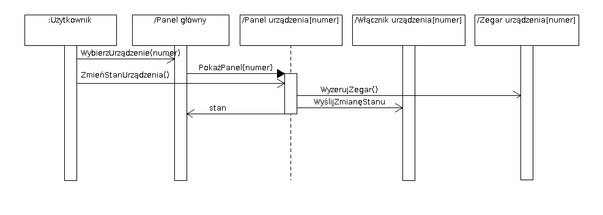

% Sterownik domowy
% Sebastian Brzezinka, Maciej Kolendowicz
% 30 Maja, 2015

Wstęp
=====

Przeznaczenie
-------------

Sterownik przeznaczony jest do zdalnego i scentralizowanego zarządzania
urządzeniami elektrycznymi poprzez włączanie ich i wyłączanie. Sterownik
zaprojektowany jest z myślą o zarządzaniu światłem i prostymi urządzeniami
RTV/AGD. Drugorzędną funkcją sterownika jest odczyt danych z czujników do
niego podłączonych (temperatura, wilgotność, ciśnienie lub inne). 

Ogólny opis użytkowania
-----------------------

Sterownik obsługiwany jest za pomocą dotykowego wyświetlacza, który pełni rolę
wejścia/wyjścia. Na ekranie znajdują się cztery przyciski odpowiadające
kolejnym portom, zegar oraz przycisk umożliwiający parowanie urządzenia z
telefonem. Informacje o aktywności danego portu przekazywane są poprzez zmianę
koloru przyciku.

Możliwości
----------

- obsługa urządzeń za pośrednictwem portów OUT,
- obsługa zujników za pośrednictwem portów IN,
- prezentacja wyników pobranych z portów IN,
- ekran LCD służący do prezentacji wyników,

Założenia konstrukcyjne
-----------------------

Głównym założeniem przy tworzeniu poniższej dokumentacji jest przewodowe
połączenie wszystkich elementów systemu, włączając w to urządzenia zewnętrzne
jak i dołączane do sterownika czujniki.

W dokumentacji nie uwzględniono technicznego rozwiązania (protokołu)
komunikacji pomiędzy czujnikami a samym sterownikiem -- jest to problem na
tyle złożony, że wymaga rozważenia podczas implementacji opisanych rozwiązań.
Zakłada się również, że dane z czujników trafiają do sterownika w postaci
obrobionej i znormalizowanej, tak, aby zagwarantować uniwersalność opisywanego
urządzenia i możliwość rozszerzania go o dodatkowe czujniki.

Mechanizm włączania i wyłączania urządzeń zewnętrznych może zostać
zrealizowany przy użyciu zewnętrznych układów włączników urządzeń, zbudowanych
z zastosowaniem np. przekaźników magnetycznych lub droższych przekaźników
półprzewodnikowych (solid-state relay). Rozwiązuje to problem
załączania wysokiego napięcia poprzez niskonapięciową logikę sterownika.

W poniższej dokumentacji świadomie nie określono liczby portów służących do
komunikacji z urządzeniami wejściowymi ani czujnikami. Wynika to z faktu, że
jedynym ograniczeniem jest techniczna realizacja sterownika, której to ta
dokumentacja nie obejmuje.

Model statycznych aspektów sterownika
=====================================

Przypadki użycia
----------------

System został zaprojektowany do użytkowania przez jedną osobę jednocześnie,
jednak podczas działania systemu nie musi być to ta sama osoba. Poniżej
pokazany jest diagram przypadków użycia sterownika.

Na diagramie przedstawiono siedem przypadków użycia:

- wybierz akcję z panelu --
:   Ten przypadek użycia wywołuje się gdy użytkownik dostaje się do panelu
    administracyjnego któregoś z urządzeń poprzez naciśnięcie odpowiadającego
    mu przycisku na wyświetlaczu. Pozwala na (generalizuje) przypadki "wybierz
    zmianę stanu" oraz "ustaw zegar".

- wybierz zmianę stanu --
:   Ten przypadek pokrywa rozkaz użytkownika do sterownika o zmianę
    aktualnego stanu wybranego urządzenia wyjściowego. Jednocześnie użytkownik
    może wywołać przypadek "ustaw zegar" opisany poniżej.

- ustaw zegar --
:   Pozwala użytkownikowi na ustawienie czasu do automatycznej zmiany stanu
    urządzenia wyjściowego. Może zostać wywołany samodzielnie jako szczególna
    akcja z panelu administracyjnego lub rozszerzać przypadek "wybierz zmianę
    stanu".

- odczytaj dane z czujników --
:   Przypadek reprezentujący możliwość odczytania z wyświetlacza informacji
    dostarczanych przez podłączone do sterownika czujniki.

- odczytaj zegar dla urządzenia --
:   Przypadek reprezentujący możliwość odczytania ustawionego w przypadku
    "ustaw zegar" czasu do kolejnej zmiany stanu urządzenia.

- zmień stan urządzenia --
:   Ten przypadek reprezentuje faktyczną zmianę stanu urządzenia wyjściowego,
    wywoływaną przez użytkownika

- automatycznie zmień stan urządzenia --
:   Ten przypadek reprezentuje faktyczną zmianę stanu urządzenia wyjściowego
    _automatycznie_, zgodnie z ustawionym przez użytkownika zegarem.

Użytkownik używa systemu wybierając konkretne akcje z paneli urządzeń
(aktywnie, trzy pierwsze przypadki użycia) lub odczytując dane pojawiające się
na głównym ekranie (pasywnie, kolejne dwa przypadki użycia). Ostatni przypadek
jest wywoływany wewnętrznie poprzez sterownik na podstawie wprowadzonych przez
użytkownika rozkazów.

Uproszczony widok konstrukcji obiektu
-------------------------------------

- główny kontroler --
:   Obiekt zajmujący się kontrolą wszystkich urządzeń oraz czujników, jak
    również obsługą zdarzeń interfejsu (rozkazy użytkownika i wyświetlanie
    informacji na ekranie)
    
- zegary urządzeń --
:   Jednostki odpowiedzialne za automatyczną zmianę stanu urządzeń
    wejściowych. 
    
- wyświetlacz i dotyk wyświetlacza --
:   Stanowią całość interfejsu użytkownika. Wyświetlacz dotykowy (pomimo
    bycia postrzeganym jako jedno fizyczne urządzenie) zdecydowano się opisać
    jako dwa różne obiekty. Pozwala to na ewentualną modyfikację sterownika i
    zastąpienie wyświetlacza dotykowego wyświetlaczem oddzielonym od klawiatury.
    
- czujnik --
:   Reprezentuje wejście interfejsu czujników dołączonych do sterownika.

- włącznik urządzenia --
:   Reprezenteuje fizyczne układy podłączone do urządzeń wyjściowych. Ich
    zadaniem jest ujednolicenie zadań włączania i wyłączania urządzeń.

Z powyżej opisanych przupadków użycia oraz wymagań systemu jasno wynika
pokazany poniżej diagram klas. Należy zauważyć że nie jest to diagram klas w
ścisłym rozumieniu UML -- służy jedynie do opisania budowy sterownika w
kontekście wykonywanych funkcji.

Powyższy diagram klas wynika bezpośrednio z opisanych wcześniej przypadków
użycia. Klasy na nim opisane pokrywają wszystkie przypadki użycia. Przypadki
"wybierz akcję z panelu" wiążą obiekty "kontroler" oraz obiekty wyświetlacza.
Odpowiednie uszczególnienia tych przypadków wywołują przypadki "ustaw zegar" i
"zmień stan urządzenia", które wykonują się pomiędzy odpowiednio "zegarami
urządzenia" i "kontrolerem" oraz "włącznikami urządzenia" i "kontrolerem".
Przypadek "automatycznie zmień stan urządzenia" wiąże klasy "zegar urządzenia"
i "włącznik urządzenia" dla każdego z urządzeń wejściowych.

Ze względu na bezpieczeństwo systemu zdecydowano o fizycznym rozdzieleniu
głównego kontrolera i zegarów urządzeń. Pozwala to na niezawodne działanie
automatycznego wyłączania urządzeń w przypadku awarii innych obiektów systemu.
Wprowadza to również komplikację w postaci podwójnego wejścia włącznika
urządzenia, co może prowadzić do wyścigu o zasoby (przypadek jednoczesnej
zmiany stanu urządzenia automatycznie, na wniosek zegara i na żądanie
użytkownika poprzez kontroler).

Dynamiczne aspekty sterownika
=============================

Diagramy sekwencji przypadków użycia
------------------------------------

Poniższe diagramy sekwencji skupiają się na przypadkach użycia
generalizowanych przez przypadek "wybierz akcję z panelu". Należy jednak
zauważyć że pozostałe aktywne przypadki użycia ("zmień stan urządzenia" i
"automatycznie zmień stan urządzenia") są wywoływane zgodnie z akcjami
użytkownika w panelu, a co za tym idzie są pokrywane przez te same diagramy
sekwencji, bo należą do tego samego scenariusza.

Przypadki "odczytaj dane z czujników" i "odczytaj zegar dla urządzenia" są z
założenia pasywne -- użytkownik odczytuje dane z panelu głównego bez wpływania
na działanie sterownika. Główny kontroler odczytuje dane z czujników w czasie
rzeczywistym, a zegary urządzeń otrzymuje w przypadkach aktywnych i następnie
porównuje z własnym zegarem.

### Zmiana stanu urządzenia

Powyższy diagram sekwencji opisuje przypadek zmiany stanu urządzenia jako
samodzielne wyszczególnienie przypadku "wybierz akcję z panelu". Użytkownik
naciska przycisk skojarzony z wybranym przez niego urządzeniem wejściowym na
panelu głównym. Uaktywnia się panel administracyjny wybranego urządzenia, na
którym użytkownik wybiera przycisk zmiany stanu. Do włącznika urządzenia
zewnętrznego wysyłany jest sygnał zmiany stanu przy jednoczesnym wyzerowaniu
zegara, a następnie obecny stan
zwracany jest do panelu głównego, dzięki czemu może zostać wyświetlony
użytkownikowi. Powrót do panelu głównego następuje w tym przypadku
automatycznie.

Powodem zerowania zegara jest fakt, że przy ustawianiu go użytkownik miał na
myśli automatyczne włączenie lub wyłączenie urządzenia. Przykładowo jeśli
użytkownik włącza radio, ustawiając czas zmiany stanu na godzinę nocną, a
następnie manualnie je wyłącza, to zapewne nie chce żeby radio obudziło go
nocą -- tak by się stało, gdyby zegar nie był zerowany.

### Zmiana stanu urządzenia wejściowego wraz z ustawieniem zegara

Kolejny diagram sekwencji przedstawia kolejne wyszczególnienie przypadku
"wybierz akcję z panelu", tym razem rozszerzone o przypadek "ustaw zegar"
(który może zostać wywołany samodzielnie). Podobnie jak poprzednio użytkownik
wybiera z panelu przycisk kojarzony z urządzeniem, jednak zamiast nacisnąć
przycisk zmiany stanu ustawia zegar przy pomocy widżetu na ekranie dotykowym.
Następnie naciska przycisk zmiany stanu (lub nie naciska go, co stanowi
przypadek "ustaw zegar" wywołany samodzielnie), a następnie przycisk powrotu do
ekranu głównego. Dopiero wtedy faktycznie ustawiany jest zegar dla urządzenia.
Ma to na celu uniknięcie sytuacji w której użytkownik po wybraniu czasu
zastanawia się, a następnie zmienia stan manualnie równocześnie z zegarem.

Panele konfiguracyjne
=====================

OUT
---

Po podłączeniu urządzenia do portu OUT nr staje się aktywny przycisk "OUT nr",
co pozwala na przejście do panelu administracyjnego. Panel administracyjny
pozwala na włączenie/wyłączenie zasilania urządzenia podpiętego do danego
portu. Panel pozwala również na ustalenie przedziału czasowego w którym
urządzenie jest włączone. 

IN
--

Po naciśnięciu przycisku "IN nr" wyświetlone zostają informacje o sensorze
oraz dane przekazane do urządzenia przez sensor. W panelu tym znajduje
się przycisk umożliwiający odłączenie zasilania od czujnika.

